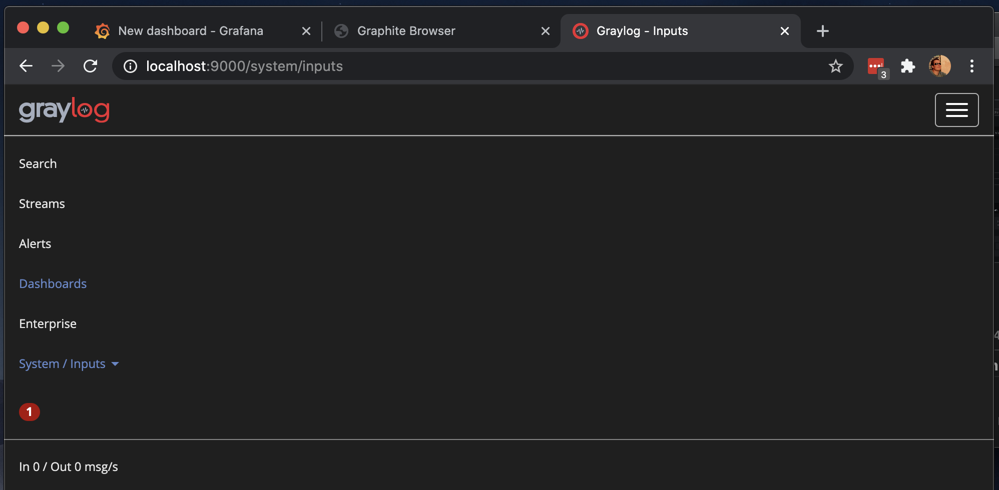
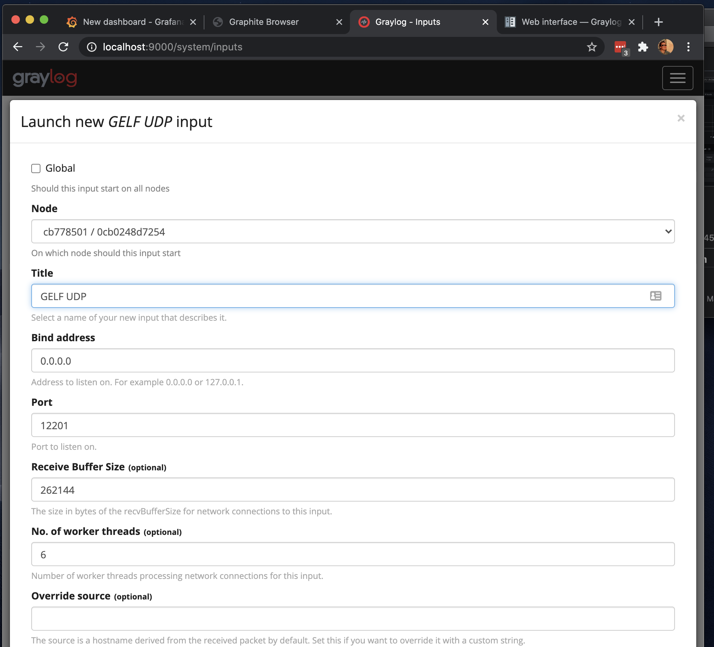
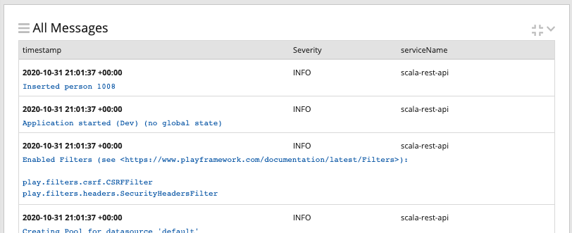
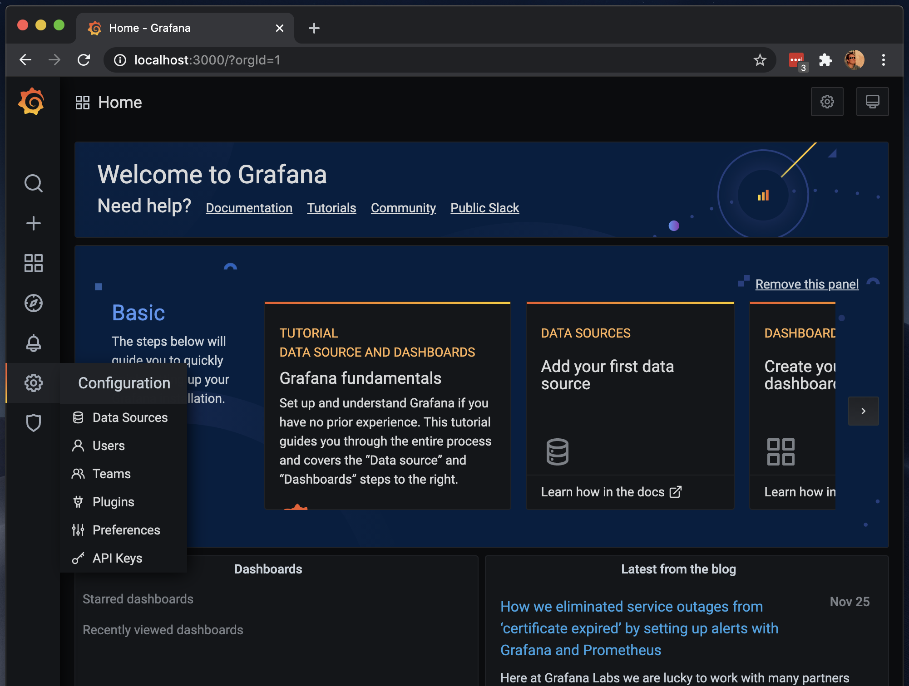
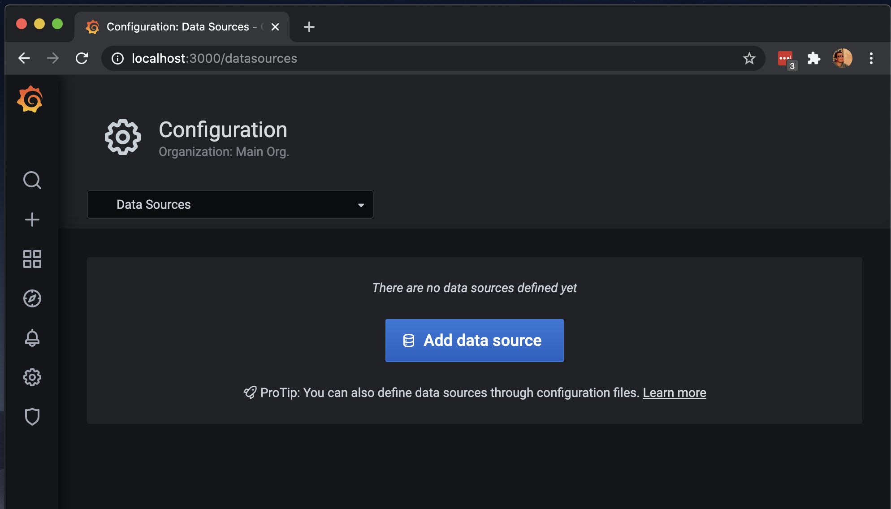
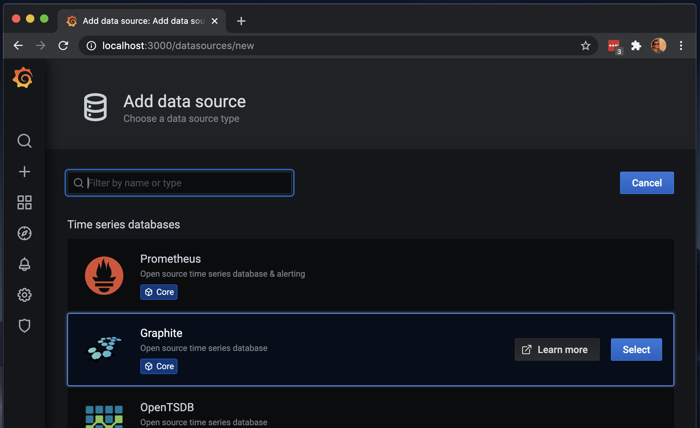
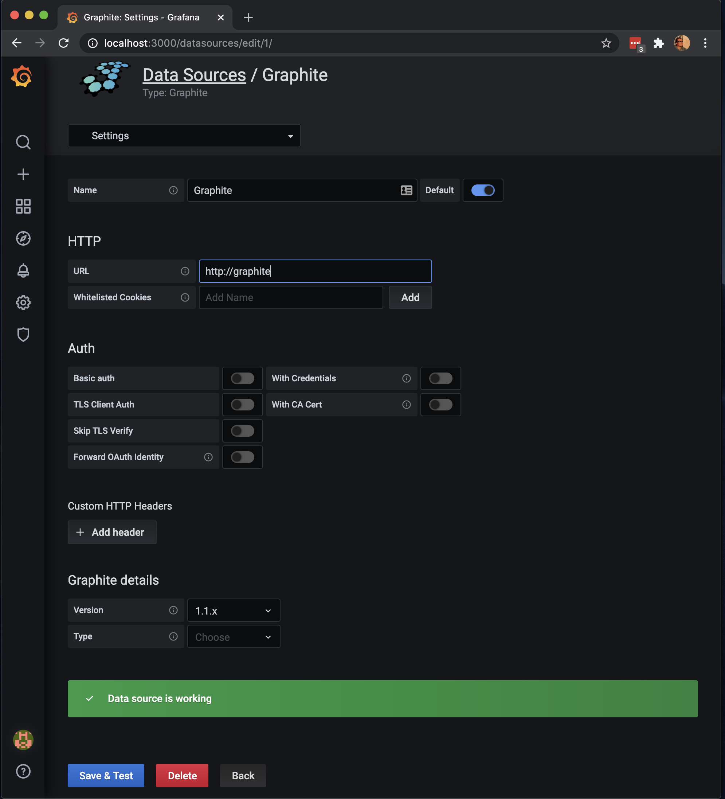
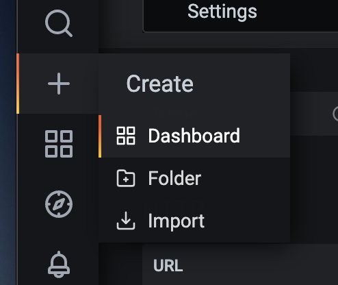
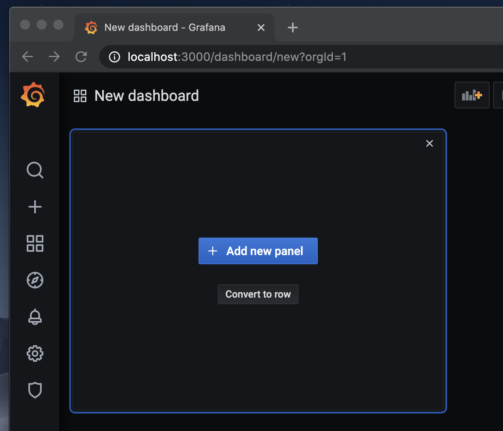
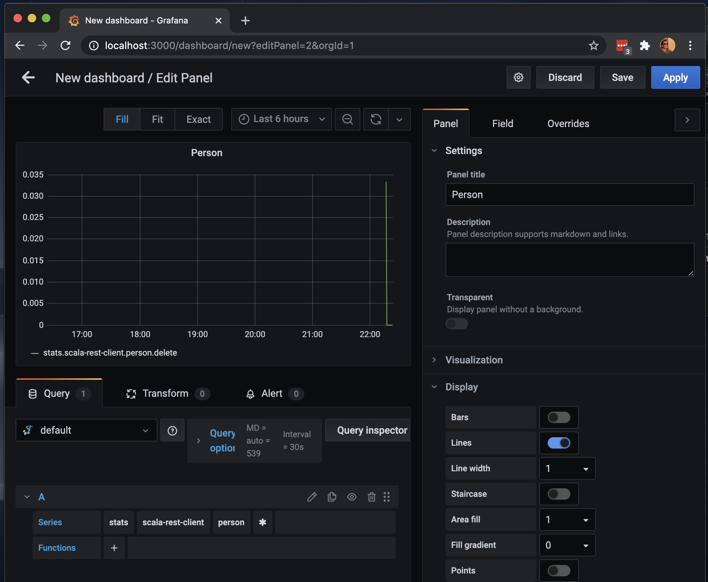

# Scala Rest API

## Prerequisites:
* Install Docker
* Install Java JDK
* Install Scala
* Install SBT

## IDE Setup

Install IntelliJ Community Edition and add the following plugins:
- [Scala](https://plugins.jetbrains.com/plugin/1347-scala)
- [Play 2 Routes](https://plugins.jetbrains.com/plugin/10053-play-2-routes)

## Create a new play application 

`sbt new playframework/play-scala-seed.g8`

## Running and debugging your program

To run your program type `~run [port]`. Default port is 9000. I will be running the app on 9001 to avoid a conflict with Graylog.


Open [http://localhost:9001](http://localhost:9001 to view your program.

Stop the program by pressing the red stop button. You may find the app keeps on running. You can kill it using 
`kill -9 $(lsof -t -i:9001)`.

To enable debugging in IntelliJ you must set Enable debugging to true.


To enable breakpoints make sure the little debug icon above is selected.


## Setup a database 

Here is the Docker Compose file:

```yaml
version: '3.1'
services:
  db:
    image: postgres
    restart: always
    ports:
      - "5432:5432"
    environment:
      POSTGRES_PASSWORD: example
```

Start the database: `docker-compose up -d`

Populate the database with mock data using MOCK_DATA.sql

Add database dependencies to your build.sbt file:

```scala
libraryDependencies += guice
libraryDependencies += "org.scalatestplus.play" %% "scalatestplus-play" % "5.0.0" % Test
libraryDependencies += "org.postgresql" % "postgresql" % "42.2.1"
libraryDependencies += jdbc
libraryDependencies += "org.playframework.anorm" %% "anorm" % "2.6.4"
```

**Note, whenever you change your build.sbt file you must run reload in sbt.**

## Working with JSON and the database

First create a model class.

```scala
package models

import anorm.{Macro, RowParser}

case class Person(
                   id: Long,
                   firstName: String,
                   lastName: String,
                   email: String,
                   gender: String,
                   ipAddress: String
                 )

object Person {
  val parser: RowParser[Person] = Macro.namedParser[Person]
}
```

Then create controller actions to read the data from the database and return as JSON.

```javascript
// GET http://localhost:9000/person/1
{
    "id":2,
    "firstName":"Saree",
    "lastName":"Seifert",
    "email":"sseifert1@chronoengine.com",
    "gender":"Female",
    "ipAddress":"179.168.74.202"
}

// GET http://localhost:9000/person
[
    {
        "id":2,
        "firstName":"Saree",
        "lastName":"Seifert",
        "email":"sseifert1@chronoengine.com",
        "gender":"Female",
        "ipAddress":"179.168.74.202"
    }, ...
]
```

```scala
@Singleton
class PersonController @Inject()(val controllerComponents: ControllerComponents, db: Database) extends BaseController {

  implicit val personWrites = Json.writes[Person]
  implicit val personReads = Json.reads[Person]

  def index(id: Long) = Action {
    db.withConnection { implicit c =>
      val person =
        SQL"""
             select *
             from people
             where id = ${id}
             """.as(Person.parser.singleOpt)
      Ok(Json.toJson(person))
    }
  }

  def list(offset: Int, limit: Int) = Action {
    db.withConnection { implicit c =>
      val people =
        SQL"""
             select *
             from people
             order by id desc
             limit ${limit} offset ${offset}
             """.as(Person.parser.*)
      Ok(Json.toJson(people))
    }
  }
```

Now for insert and update:

```javascript
// PUT http://localhost:9000/person
// Request
{
    "firstName": "Paul",
    "lastName": "McCartney",
    "email": "paulmc@gmail.com",
    "gender": "male",
    "ipAddress": "127.0.0.1"
}
// Response
{
    "id": 100
}

// POST http://localhost:9000/person/1
// Request
{
    "firstName": "Paul",
    "lastName": "McCartney",
    "email": "paulmc@gmail.com",
    "gender": "male",
    "ipAddress": "127.0.0.1"
}
// Response
{
    "updated": 1
}

```

```scala
  def insert() = Action(parse.json) { req =>
    Json.fromJson[Person](req.body) match {
      case JsSuccess(person, _) => {
        db.withConnection { implicit c =>
          val id = SQL"""
                 insert into people (firstname, lastname, email, gender, ipaddress)
                 values (${person.firstName}, ${person.lastName}, ${person.email}, ${person.gender}, ${person.ipAddress})
                 returning id
                 """.as(int("id").single)
          Ok(Json.obj("id" -> id))
        }
      }
      case _ => BadRequest(Json.obj("err" -> "Invalid Person"))
    }
  }

  def update(id: Long) = Action(parse.json) { req =>
    Json.fromJson[Person](req.body) match {
      case JsSuccess(person, _) => {
        db.withConnection { implicit c =>
          val updateRes = SQL"""
                 update people set
                   firstname = ${person.firstName},
                   lastname = ${person.lastName},
                   email = ${person.email},
                   gender = ${person.gender},
                   ipaddress = ${person.ipAddress}
                 where id = ${id}
                 """.executeUpdate()
          Ok(Json.obj("updated" -> updateRes))
        }
      }
      case _ => BadRequest(Json.obj("err" -> "Invalid Person"))
    }
  }
```

And map the controller actions to routes. Note the parameter defaults. 

```routes
GET /person/:id controllers.PersonController.index(id: Long)
GET /person controllers.PersonController.list(offset: Int ?= 0, limit: Int ?= 10)
PUT /person controllers.PersonController.insert
POST /person/:id controllers.PersonController.update(id: Long)
```

Make the default error handlers return JSON instead of HTML. Put this in the default package and it just works.

```scala
class ErrorHandler extends HttpErrorHandler {
  override def onClientError(request: RequestHeader, statusCode: Int, message: String) = {
    Future.successful(
      Status(statusCode)(Json.obj("err" -> message))
    )
  }

  override def onServerError(request: RequestHeader, exception: Throwable) = {
    Future.successful {
      println(exception.getMessage)
      InternalServerError(Json.obj("err" -> "Internal server error"))
    }
  }
}
```

## Observability: Logging to a central log server

I will be logging to Graylog. I used the Docker Compose file from the [Graylog docs](https://docs.graylog.org/en/3.2/pages/installation/docker.html).

```yaml
version: '3'
services:
  # MongoDB: https://hub.docker.com/_/mongo/
  mongo:
    image: mongo:3
    container_name: graylog_mongo
    networks:
      - graylog
  # Elasticsearch: https://www.elastic.co/guide/en/elasticsearch/reference/6.x/docker.html
  elasticsearch:
    image: docker.elastic.co/elasticsearch/elasticsearch-oss:6.8.10
    container_name: graylog_elasticsearch
    environment:
      - http.host=0.0.0.0
      - transport.host=localhost
      - network.host=0.0.0.0
      - "ES_JAVA_OPTS=-Xms512m -Xmx512m"
    ulimits:
      memlock:
        soft: -1
        hard: -1
    deploy:
      resources:
        limits:
          memory: 1g
    networks:
      - graylog
  # Graylog: https://hub.docker.com/r/graylog/graylog/
  graylog:
    image: graylog/graylog:3.3
    container_name: graylog
    environment:
      # CHANGE ME (must be at least 16 characters)!
      - GRAYLOG_PASSWORD_SECRET=somepasswordpepper
      # Password: admin
      - GRAYLOG_ROOT_PASSWORD_SHA2=8c6976e5b5410415bde908bd4dee15dfb167a9c873fc4bb8a81f6f2ab448a918
      - GRAYLOG_HTTP_EXTERNAL_URI=http://127.0.0.1:9000/
    networks:
      - graylog
    depends_on:
      - mongo
      - elasticsearch
    ports:
      # Graylog web interface and REST API
      - 9000:9000
      # Syslog TCP
      - 1514:1514
      # Syslog UDP
      - 1514:1514/udp
      # GELF TCP
      - 12201:12201
      # GELF UDP
      - 12201:12201/udp
      # Plaintext
      - 5555:5555
networks:
  graylog:
    driver: bridge
```

Start Graylog.

```
docker-compose up -d
```


I used the [GELF Logback Appender from paluch.biz](https://logging.paluch.biz/examples/logback.html).

```xml
  <appender name="GELF" class="biz.paluch.logging.gelf.logback.GelfLogbackAppender">
    <host>udp:localhost</host>
    <port>12201</port>
    <version>1.1</version>
    <facility>logstash-gelf</facility>
    <extractStackTrace>true</extractStackTrace>
    <filterStackTrace>true</filterStackTrace>
    <includeLocation>true</includeLocation>
    <mdcProfiling>true</mdcProfiling>
    <timestampPattern>yyyy-MM-dd HH:mm:ss,SSS</timestampPattern>
    <maximumMessageSize>8192</maximumMessageSize>
    <additionalFields>serviceName=scala-rest-api</additionalFields>
    <additionalFieldTypes>serviceName=String</additionalFieldTypes>
    <mdcFields>mdcField1,mdcField2</mdcFields>
    <dynamicMdcFields>myMdc.*,[a-z]+Field</dynamicMdcFields>
    <dynamicMdcFieldTypes>my_field.*=String,business\..*\.field=double</dynamicMdcFieldTypes>
    <includeFullMdc>true</includeFullMdc>
    <filter class="ch.qos.logback.classic.filter.ThresholdFilter">-->
      <level>WARN</level>
    </filter>
  </appender>
```

I added logging statements to my code.

```scala
  val logger = Logger("application")
  logger.info(s"Updated person $id")
```

### Configuring Graylog

Open the Graylog UI at http://localhost:9000

Create a GELF UDP input by going to System / Inputs.





Create some log messages by calling the actions on PersonController. You should see these appear in the log.



## Observability: Tracking metrics using Grafana, Graphite and statsd

Here is the docker compose file to get Grafana and Graphite up and running:

```yaml
version: '3'
services:
  # Grafana for metrics and alerts
  grafana:
    image: grafana/grafana:7.3.4
    ports:
      - 3000:3000
    networks:
      - grafana
  graphite:
    image: graphiteapp/graphite-statsd
    ports:
      - 80:8080
      # - 2003-2004:2003-2004
      # - 2023-2024:2023-2024
      - 8125:8125/udp
      # - 8126:8126
    networks:
      - grafana
networks:
  grafana:
    driver: bridge
```

Once this is up and running you can access Grafana at http://localhost:3000 with username and password of admin/admin.

I am using the statsd client from timgroup.com.

```scala
libraryDependencies += "com.timgroup" % "java-statsd-client" % "3.1.0"
```

You use it like this:

```scala
  val statsd = new NonBlockingStatsDClient("scala-rest-client", "localhost", 8125)
  statsd.incrementCounter("person.index")
```

### Configuring Grafana

[Open Grafana](http://localhost:3000) and log in using admin/admin.



Add Graphite as a data source.







Create some stats. You can do this by calling the PersonController actios. 

Dispaly your stats on a dashboard.







## TODO

- Add Correlation ID to logs
- Error handling
