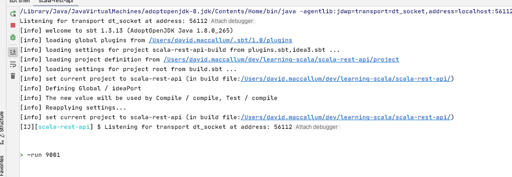
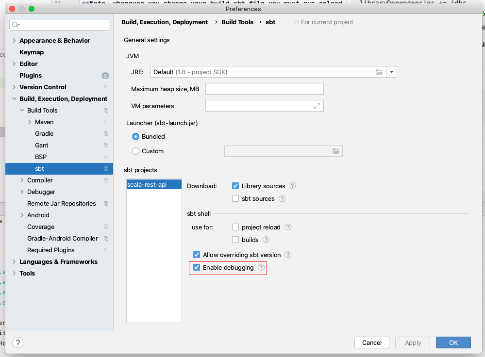
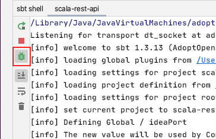

# Scala Rest API

### Prerequisites:
* Install Docker
* Install Java JDK
* Install Scala
* Install SBT

### IDE Setup

Install IntelliJ Community Edition and add the following plugins:
- [Scala](https://plugins.jetbrains.com/plugin/1347-scala)
- [Play 2 Routes](https://plugins.jetbrains.com/plugin/10053-play-2-routes)

### Create a new play application 

`sbt new playframework/play-scala-seed.g8`

### Running and debugging your program

To run your program type `~run [port]`. Default port is 9000.



Open [http://localhost:9000](http://localhost:9000) to view your program.

Stop the program by pressing the red stop button. Pressing enter to stop the program causes the process to carry on running in the background.

To enable debugging in IntelliJ you must set Enable debugging to true.



To enable breakpoints make sure the little debug icon above is selected.



### Setup a database 

Here is the Docker Compose file:

```yaml
version: '3.1'
services:
  db:
    image: postgres
    restart: always
    ports:
      - "5432:5432"
    environment:
      POSTGRES_PASSWORD: example
```

Start the database: `docker-compose -f docker-compose.yaml up -d`

Add database dependencies to your build.sbt file:

```scala
libraryDependencies += guice
libraryDependencies += "org.scalatestplus.play" %% "scalatestplus-play" % "5.0.0" % Test
libraryDependencies += "org.postgresql" % "postgresql" % "42.2.1"
libraryDependencies += jdbc
libraryDependencies += "org.playframework.anorm" %% "anorm" % "2.6.4"
```

**Note, whenever you change your build.sbt file you must run reload in sbt.**

### Working with JSON and the database

First create a model class.

```scala
package models

import anorm.{Macro, RowParser}

case class Person(
                   id: Long,
                   firstName: String,
                   lastName: String,
                   email: String,
                   gender: String,
                   ipAddress: String
                 )

object Person {
  val parser: RowParser[Person] = Macro.namedParser[Person]
}
```

Then create controller actions to read the data from the database and return as JSON.

```javascript
// GET http://localhost:9000/person/1
{
    "id":2,
    "firstName":"Saree",
    "lastName":"Seifert",
    "email":"sseifert1@chronoengine.com",
    "gender":"Female",
    "ipAddress":"179.168.74.202"
}

// GET http://localhost:9000/person
[
    {
        "id":2,
        "firstName":"Saree",
        "lastName":"Seifert",
        "email":"sseifert1@chronoengine.com",
        "gender":"Female",
        "ipAddress":"179.168.74.202"
    }, ...
]
```

```scala
@Singleton
class PersonController @Inject()(val controllerComponents: ControllerComponents, db: Database) extends BaseController {

  implicit val personWrites = Json.writes[Person]
  implicit val personReads = Json.reads[Person]

  def index(id: Long) = Action {
    db.withConnection { implicit c =>
      val person =
        SQL"""
             select *
             from people
             where id = ${id}
             """.as(Person.parser.singleOpt)
      Ok(Json.toJson(person))
    }
  }

  def list(offset: Int, limit: Int) = Action {
    db.withConnection { implicit c =>
      val people =
        SQL"""
             select *
             from people
             order by id desc
             limit ${limit} offset ${offset}
             """.as(Person.parser.*)
      Ok(Json.toJson(people))
    }
  }
```

Now for insert and update:

```javascript
// PUT http://localhost:9000/person
// Request
{
    "firstName": "Paul",
    "lastName": "McCartney",
    "email": "paulmc@gmail.com",
    "gender": "male",
    "ipAddress": "127.0.0.1"
}
// Response
{
    "id": 100
}

// POST http://localhost:9000/person/1
// Request
{
    "firstName": "Paul",
    "lastName": "McCartney",
    "email": "paulmc@gmail.com",
    "gender": "male",
    "ipAddress": "127.0.0.1"
}
// Response
{
    "updated": 1
}

```

```scala
  def insert() = Action(parse.json) { req =>
    Json.fromJson[Person](req.body) match {
      case JsSuccess(person, _) => {
        db.withConnection { implicit c =>
          val id = SQL"""
                 insert into people (firstname, lastname, email, gender, ipaddress)
                 values (${person.firstName}, ${person.lastName}, ${person.email}, ${person.gender}, ${person.ipAddress})
                 returning id
                 """.as(int("id").single)
          Ok(Json.obj("id" -> id))
        }
      }
      case _ => BadRequest(Json.obj("err" -> "Invalid Person"))
    }
  }

  def update(id: Long) = Action(parse.json) { req =>
    Json.fromJson[Person](req.body) match {
      case JsSuccess(person, _) => {
        db.withConnection { implicit c =>
          val updateRes = SQL"""
                 update people set
                   firstname = ${person.firstName},
                   lastname = ${person.lastName},
                   email = ${person.email},
                   gender = ${person.gender},
                   ipaddress = ${person.ipAddress}
                 where id = ${id}
                 """.executeUpdate()
          Ok(Json.obj("updated" -> updateRes))
        }
      }
      case _ => BadRequest(Json.obj("err" -> "Invalid Person"))
    }
  }
```

And map the controller actions to routes. Note the parameter defaults. 

```routes
GET /person/:id controllers.PersonController.index(id: Long)
GET /person controllers.PersonController.list(offset: Int ?= 0, limit: Int ?= 10)
PUT /person controllers.PersonController.insert
POST /person/:id controllers.PersonController.update(id: Long)
```

Make the default error handlers return JSON instead of HTML. Put this in the default package and it just works.

```scala
class ErrorHandler extends HttpErrorHandler {
  override def onClientError(request: RequestHeader, statusCode: Int, message: String) = {
    Future.successful(
      Status(statusCode)(Json.obj("err" -> message))
    )
  }

  override def onServerError(request: RequestHeader, exception: Throwable) = {
    Future.successful {
      println(exception.getMessage)
      InternalServerError(Json.obj("err" -> "Internal server error"))
    }
  }
}
```